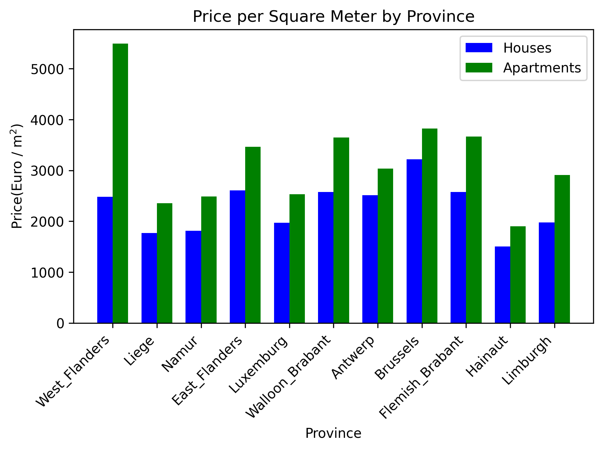

# Immo_Eliza_Data_Analysis

## Description
This project is a data analysis and visualization project focused on analyzing a dataset of properties for sale from the website immoweb.be. The project involves cleaning the dataset, performing exploratory data analysis and creating visualizations to gain insights into the properties and their characteristics.
In addition to the data analysis and visualization, this project also incorporates machine learning (ML) techniques to build predictive models for property prices based on various features. Three different ML methods have been utilized to create these models: Linear Regression, Decision Tree Regression, and XGBoost Regression.
## Installation
. Install the required libraries:

   - 
   - 
   - 
   - 
   - 
   - 
   - 
   - 

   You can click on the badge links to learn more about each library and its specific version used in this project.
   You can install them manually using `pip install <library name>` or just running `pip install -r requirements.txt`.

## Usage
1. Clone the repository to your local machine.
2. Create a virtual environment using the command: `python -m venv project-env`
3. Activate the virtual environment:
   - For Windows: `project-env\Scripts\activate`
   - For macOS/Linux: `source project-env/bin/activate`
4. Install the required dependencies mentioned in the installation section.

## FastAPI Implementation
The FastAPI implementation allows users to predict property prices based on various features. The user needs to provide feature values in JSON format, such as living area, number of bedrooms, etc. The FastAPI app uses the trained XGBoost regression models to make predictions and returns the predicted property prices in response.

## Contributors
Fatemeh Loni

## Timeline
. Data Analysis and Visualization: Approximately 5 days\n
. Machine Learning Model Development: Approximately 4 days\n
. FastAPI Integration: Approximately 3 days\n

## Personal Situation
This project was completed as part of the AI Bootcamp at BeCode.org.

## Data Source

The data used in this project is sourced from the [challenge_collecting_data](https://github.com/Finol12/challenge-collecting-data) repository, which collects data from around 20,000 properties for sale from the immoweb.be website. The dataset provides information such as price, bedroom count, living area, and various property attributes.

Please refer to the [challenge_collecting_data](https://github.com/Finol12/challenge-collecting-data) repository for more information on how the data was collected and preprocessed.

### How to Use FastAPI
1. Install the required libraries:

. FastAPI: "pip install fastapi"
. Uvicorn (ASGI server): "pip install uvicorn"
. Pydantic (Data validation and serialization): "pip install pydantic"
You can also install all the required dependencies by running pip install -r requirements.txt.

2. Run the FastAPI app using the following command:
uvicorn app:app --reload

3. Now, you can access the FastAPI documentation and interact with the API by visiting "http://127.0.0.1:8000/docs" in your web browser.
The main endpoint is "/features", which accepts a POST request with property features in JSON format. 
4. The JSON format for the property features should be as follows(you can see an example):

{
    "houseORapartment": "house",   # Type of property: "house" or "apartment"
    "Bedroom": 3,                  # number of bedrooms(integer)
    "Living_area": 120,            # integer
    "Swimming_pool": 1,    # if the property has a swimming pool enter 1, otherwise enter 0
    "Garden": 1,           # if the property has a Garden enter 1, otherwise enter 0
    "Garden_area": 200,    # integer
    "Surface_of_land": 400,  # integer
    "Terrace": 1,            # if the property has a Trrace enter 1, otherwise enter 0
    "Facade": 4,             # integer
    "Open_Fire": 0,          # if the property has a Open_Fire enter 1, otherwise enter 0
    "Furnished": 1,          # if the property is Furnished enter 1, otherwise enter 0
    "province": "East_Flanders",   # Province of the property
    "District": "Gent"             # District of the property
}

##### Data Validation for Provinces and Districts
To use the FastAPI endpoint for predicting property prices, please ensure that you provide the correct spellings and letters for the provinces and their corresponding districts. The valid provinces and their districts are listed below:

    East_Flanders=["Gent","Oudenaarde","Eeklo","Aalst","Dendermonde","Sint-Niklaas",]
    West_Flanders=["Diksmuide", "Brugge", "Diksmuide", "Kortrijk", "Oostend","Roeselare", "Tielt", "Veurne", "Ieper","Mouscron" ]
    Antwerp=["Antwerp","Turnhout","Mechelen"]
    Limburgh=["Maaseik","Hasselt","Tongeren"]
    Brussels=["Brussels"]
    Flemish_Brabant=["Leuven","Halle-Vilvoorde"]
    Walloon_Brabant=["Nivelles"]
    Liege=["Liège","Verviers","Waremme","Huy"]
    Luxemburg =["Neufchâteau","Virton","Marche-en-Famenne","Arlon","Bastogne"]  
    Namur=["Dinant","Namur","Philippeville"]
    Hainaut=["Ath","Thuin","Tournai","Soignies","Mons","Charleroi"] 

Please make sure that you enter the province and district exactly as listed above to obtain accurate predictions. Incorrect spellings or letters may result in incorrect predictions.

5. After sending the POST request, the API will respond with the predicted property price in JSON format.

6. You can also use the Swagger UI provided by FastAPI to test the API interactively. Visit "http://127.0.0.1:8000/docs" in your web browser to access the Swagger UI.

That's it! You can now use the FastAPI API to predict property prices based on different property features for both houses and apartments. Enjoy exploring and predicting property prices with the power of FastAPI and machine learning!

